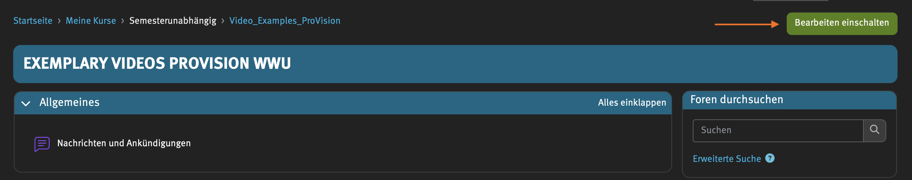
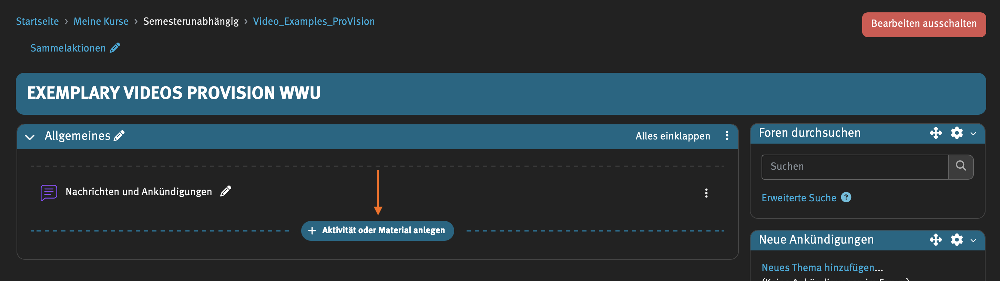
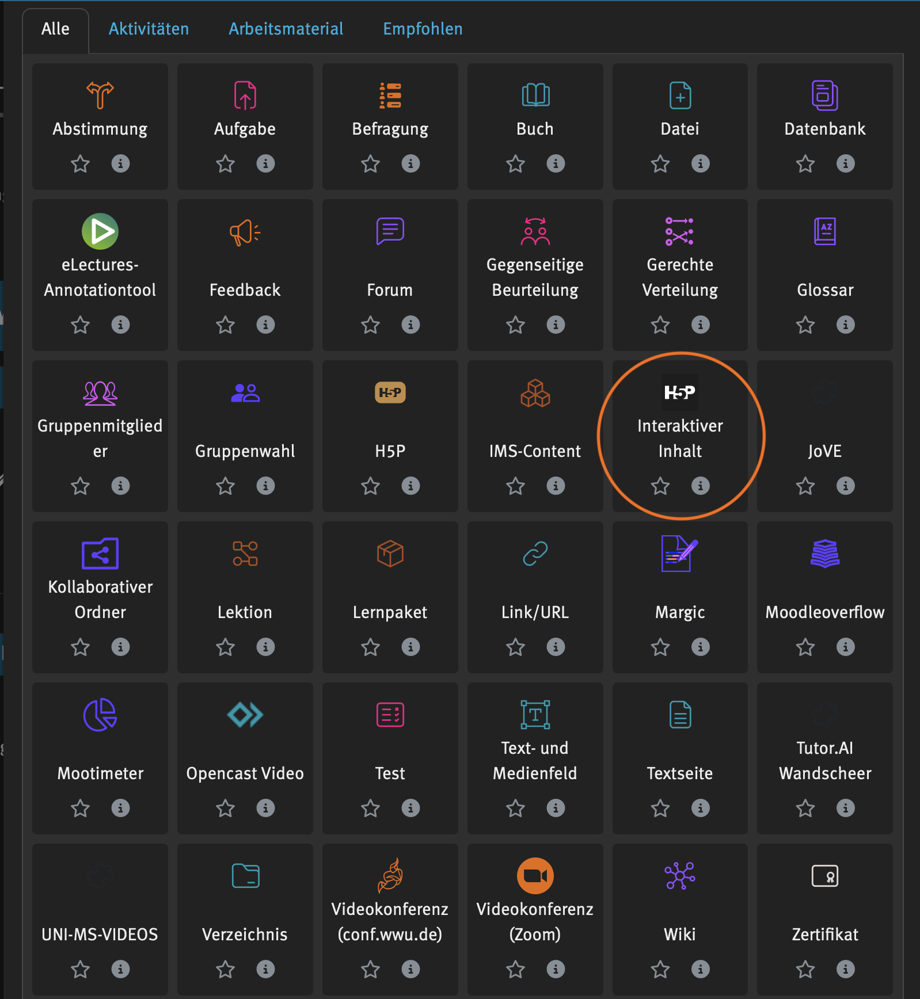
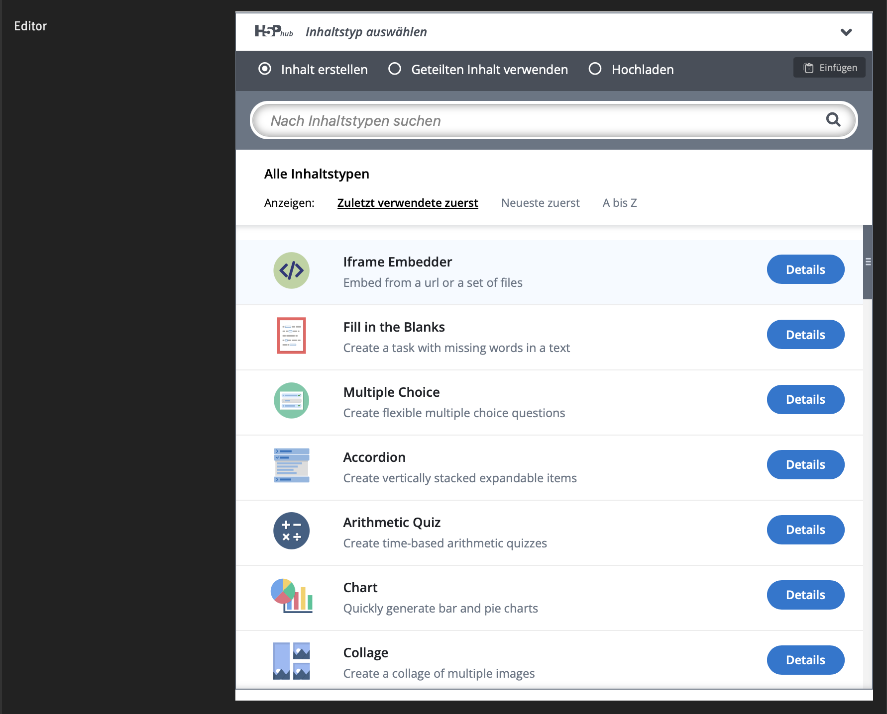
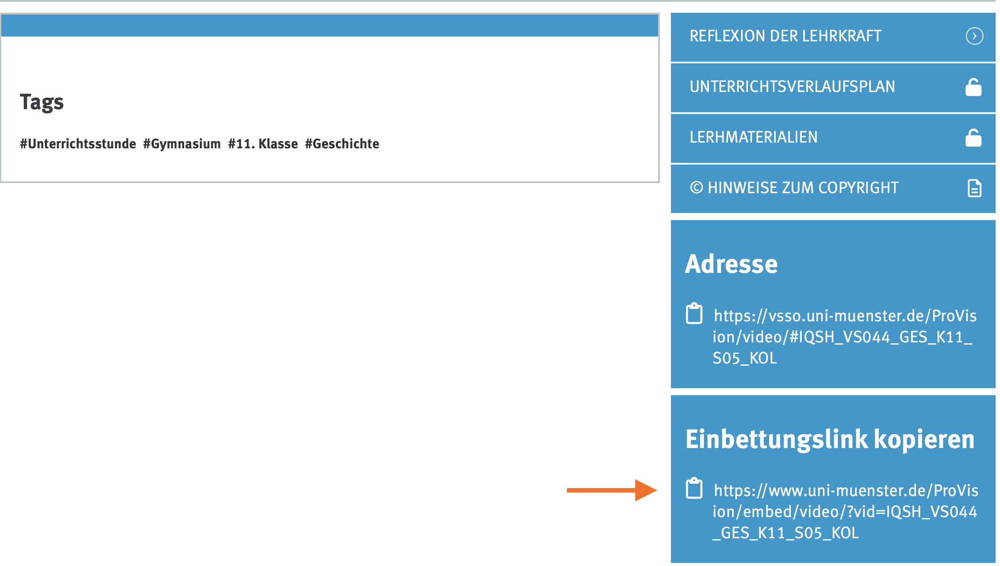
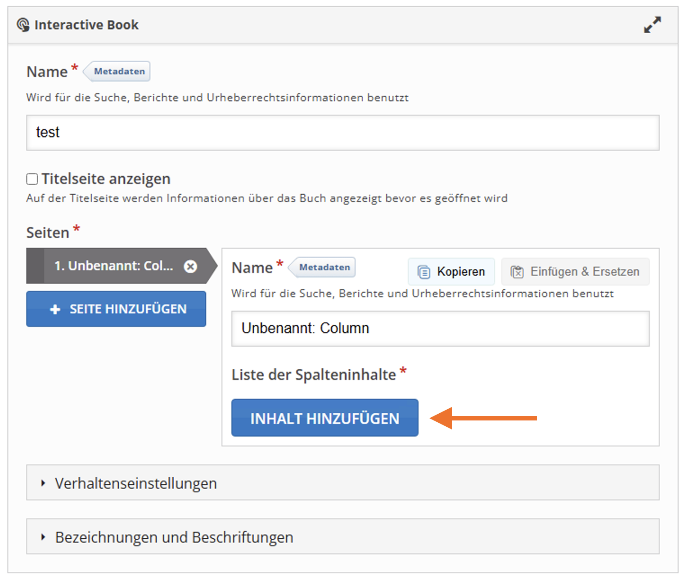
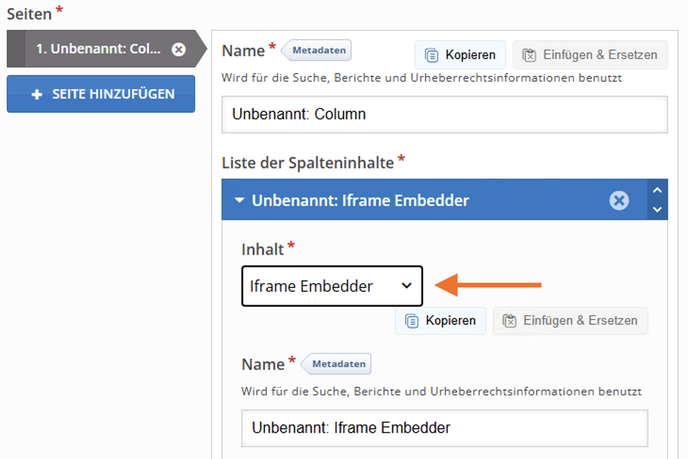
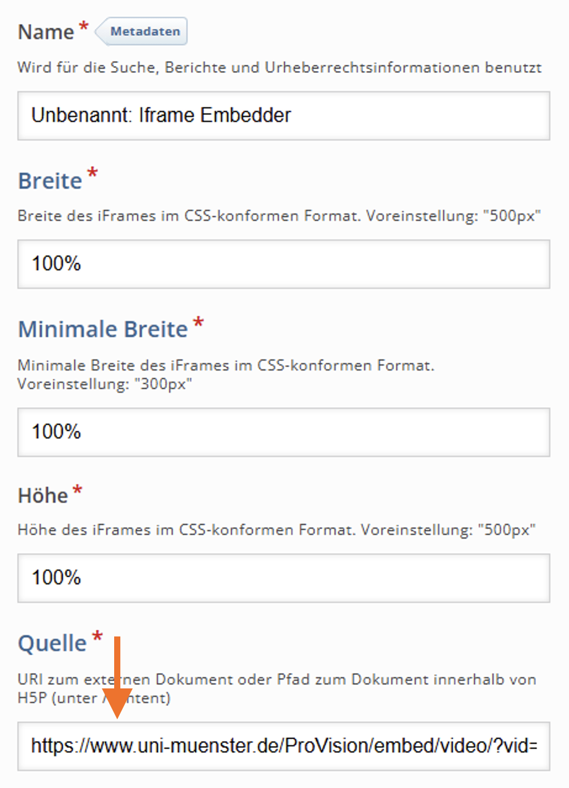
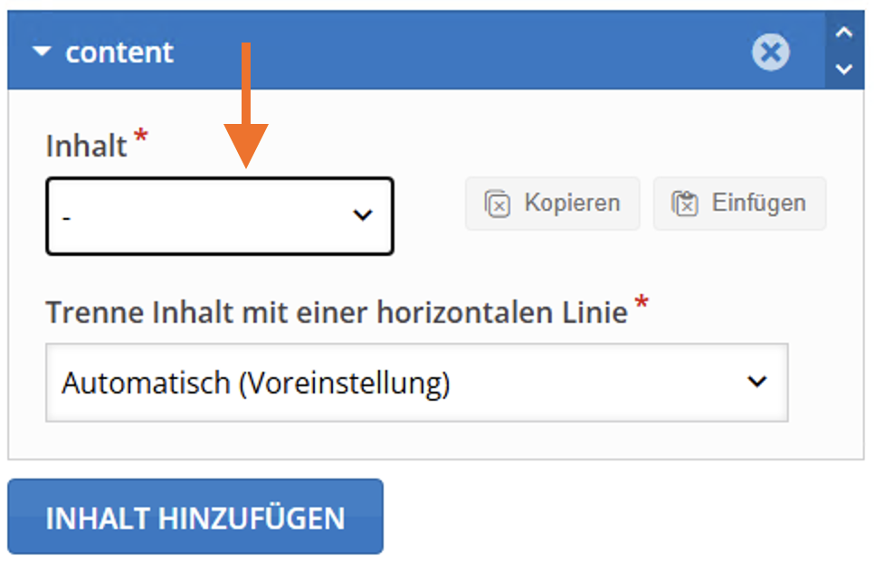

import { Steps } from '@astrojs/starlight/components';
import { Tabs, TabItem } from '@astrojs/starlight/components';
import MediaFrame from '/src/components/MediaFrame.astro';

### Kurzanleitung: Einbettung von Videos in der H5P-Aktivität "Interaktives Buch"

Beispiel: Download der Vorlage über "Reuse":<br/ >
[Login + Interaktives Video in einem interaktiven Buch (H5P)](https://app.lumi.education/api/v1/run/-vu0pH/embed) 

<Steps>

1. **In den Bearbeitungsmodus wechseln**
    - 1.1 Öffne die Plattform, auf der du H5P nutzt (z. B. Moodle).
    - 1.2 Klicke auf die Option, um den Bearbeitungsmodus zu aktivieren. 

    

        
Screenshot

        
    

2. **Aktivität oder Material anlegen**
    - 2.1 Wähle die Funktion „Aktivität oder Material anlegen“ aus.
    - 2.2 Scrolle durch die Optionen und wähle „Interaktive Inhalte“ (H5P).

    

        
Screenshots

        <Tabs>
            <TabItem label="H5P Aktivität anlegen"></TabItem>
            <TabItem label="H5P Aktivität auswählen"></TabItem>
        </Tabs>
    

3. **Inhaltstyp auswählen**
    - 3.1 Im H5P-Editor siehst du eine Liste von Inhaltstypen.
    - 3.2 Nutze die Suchleiste, um den gewünschten Inhaltstyp (z. B. „Interactive Book“) einzugeben und auszuwählen.
    - 3.3 Vergleiche die Tabelle, um passende Aktivitäten zu finden die mit MedienLink funktionieren-.
    - 3.4 Hinweis: Oben in der Anzeige findest du Links zu einem Tutorial und einem Beispiel, die bei der Erstellung helfen können.

    

        
Screenshot

        
    

4. **ProVision nutzen, um Video einzubinden**
    - 4.1 Im Videoportal (z. B. ProVision) einloggen
    - 4.2 Das passende Video in Videoportal finden.
    - 4.3 Das Video auswählen und den Bereich „Informationen“ öffnen.
    - 4.4 Den Einbettungslink kopieren.

    

        
Screenshot

        
    

5. **Iframe Embedder nutzen**
    - 5.1 Wählen Sie "Inhalte hinzufügen" um den Iframe Embedder einzufügen
    - 5.2 Einstellungen für das Video bearbeiten
    - 5.3 Unter Quelle den Einbettungslink einfügen 

    

        
Screenshots

        <Tabs>
            <TabItem label="(5.1) Inhalte hinzufügen"></TabItem>
            <TabItem label="(5.2) Embedder auswählen"></TabItem>
            <TabItem label="(5.3) Quelle einfügen"></TabItem>
        </Tabs>
    

6. **Weitere Inhalte**
    - 6.1 Um weitere Inhalte hinzuzufügen auf "Inhalt hinzufügen" klicken
    - 6.2 Inhalt hinzufügen
    - 6.3 Passenden Link nutzen für den jeweiligen Inhalt (siehe Tabelle)
    
    

        
Screenshot

        
    

7. **Inhalte speichern**
    - 7.1 Prüfe die Einstellungen und Vorschau.
    - 7.2 Speichere die interaktive Aktivität und füge sie deinem Kurs hinzu.
</Steps>

Fertig! 🎉