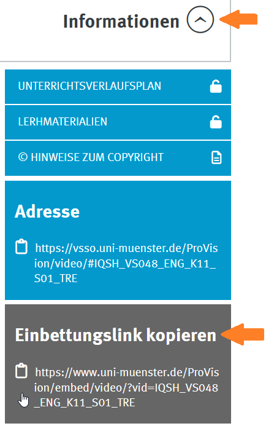
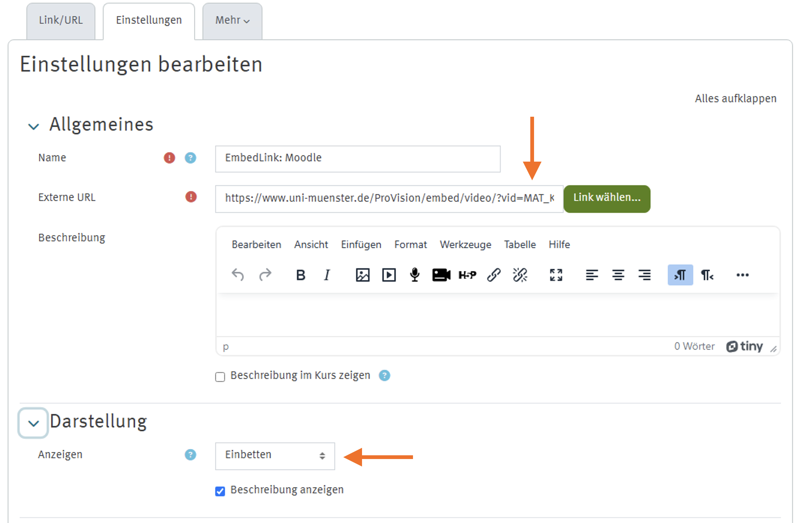

import { Tabs, TabItem } from '@astrojs/starlight/components';
import { Steps } from '@astrojs/starlight/components';
import MediaFrame from '/src/components/MediaFrame.astro';

### Anleitung: Einbettung von Videos über die Moodle-Aktivität "Link/URL" (mittels Einbettungslink)

- Name: z.B. Video-Titel
- Externe-URL: Den Einbettungslink eines spezifischen Videos aus dem Videoportal kopieren und als "Externe URL" einfügen
- Darstellung: Anzeigen: Einbetten

    
Screenshots

    <Tabs>
        <TabItem label="Einbettungslink kopieren"></TabItem>
        <TabItem label="Moodle Aktivität konfigurieren"></TabItem>
    </Tabs>

