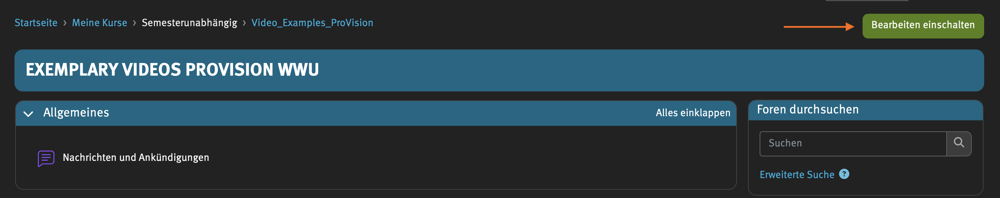
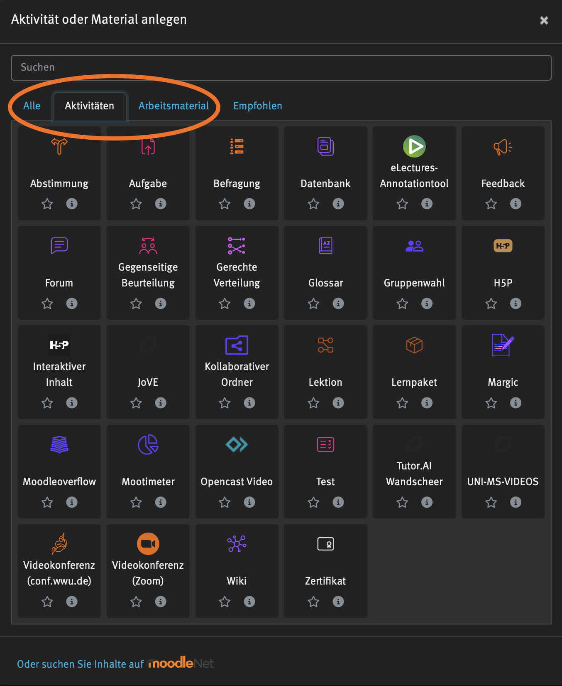
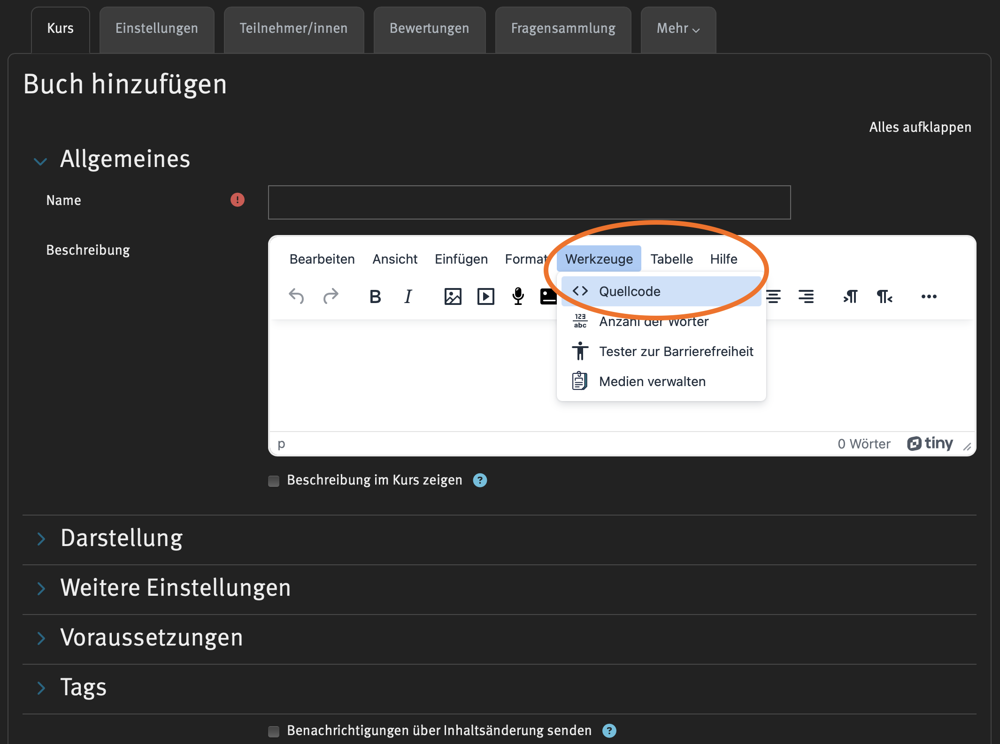
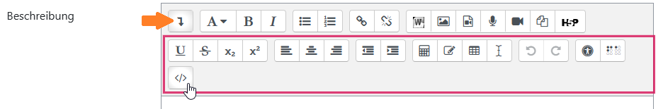
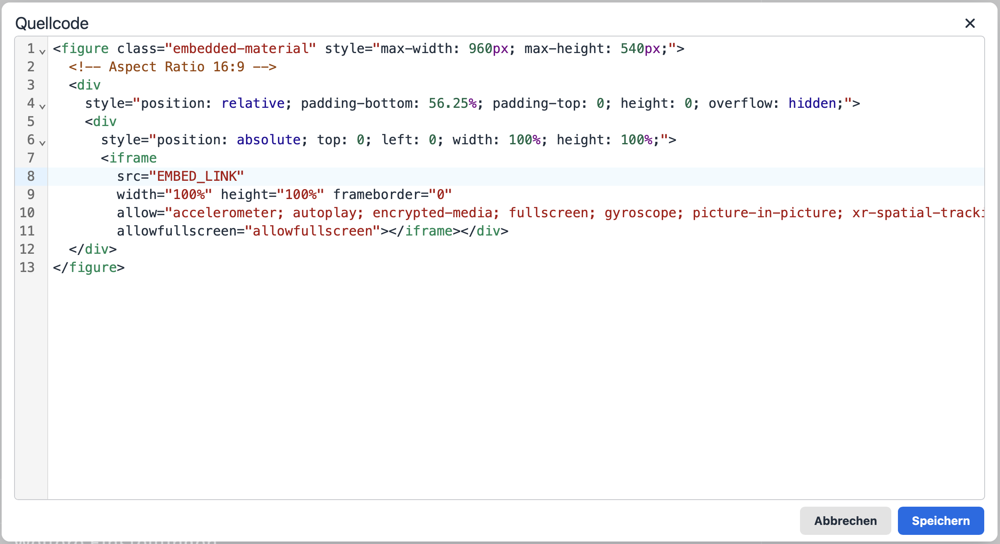
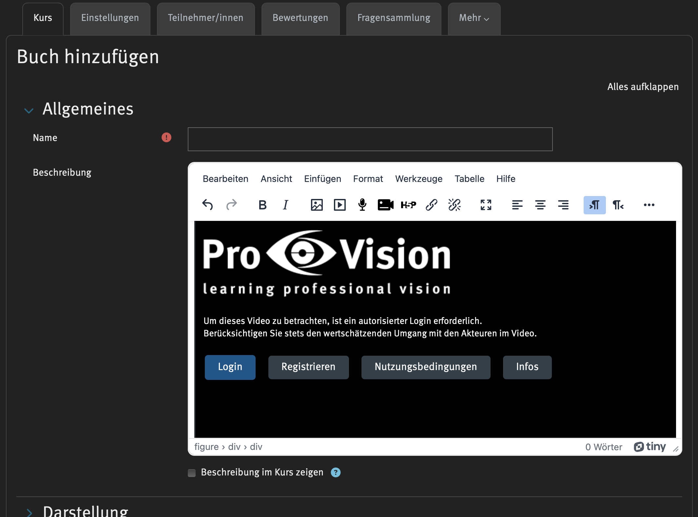

import { Tabs, TabItem } from '@astrojs/starlight/components';
import { Steps } from '@astrojs/starlight/components';
import MediaFrame from '/src/components/MediaFrame.astro';

### Anleitung: Einbettung von Videos in einem Text-/Beschreibungsfeld
**Erfordert: Einbettungscode**

Insofern die Moodle Aktivität über ein Text-/Beschreibungsfeld (Moodle-Editor) verfügt, kann das Video womöglich mit einem Einbettungscode eingebunden werden.

**Kurzanleitung:**

- EmbedCode: Einbettungscode erstellen/kopieren
- Je nach Moodle-Editor den erstellten EmbedCode einfügen:
    - über das Editor-Symbol `</>` für Quellcode-/text bzw. HTML 
    - alternativ: über (Inhalt) > Werkzeuge > Quellcode (ggf. auch Quelltext / HTML) 
    - optional:
        - Option "Beschreibung im Kurs anzeigen" wählen
        - Über diese Option kann das Video direkt auf der Kursseite dargestellt werden (falls es sich hierbei um das Beschreibungsfeld für eine Moodle-Aktivität handelt)

    
Video-Kurzanleitung

    <MediaFrame width="600px" src="https://player.uni-muenster-unterrichtsvideos.educast.nrw/6e8b38c8-a98e-4203-8361-302aaf7044f4" />

**Schritt für Schritt Anleitung:**

<Steps>
    1. In den Bearbeitungsmodus wechseln
        - Öffne die Moodle-Plattform und den entsprechenden Moodle-Kurs, auf der du eine Moodle-Aktivität erstellen möchtest.
        - Klicke auf die Option, um den Bearbeitungsmodus zu aktivieren (Bearbeitungsrechte für den Moodle-Kurs erforderlich).

        

            
Screenshot: Bearbeitungsmodus

            
        

    2. Aktivität oder Material anlegen
        - Wähle im Kursbereich „Aktivität oder Material anlegen“.
        - Entscheide dich für eine geeignete Aktivität (z. B. „Test“, „Aufgabe“ oder „Forum“) oder ein Material (z. B. „Link/URL“).

        

            
Screenshot: Aktivität anlegen

            
        

    3. Einbettungscode einfügen
        - Gehe im Editor zur Beschreibung oder dem Textfeld der Aktivität.
        - Klicke auf den Reiter „Werkzeug“.
        - Wähle „Quellcode“ / "Quelltext" oder "HTML" aus (häufige Symbole: `<⁄>` oder `<>`), um den HTML-Modus des Moodle-Editors zu öffnen.
        - Füge den EmbedCode (Einbettungscode mit dem entsprechenden EmbedLink deines Videos) ein.

        

            
Screenshots: Editor

            <Tabs>
                <TabItem label="Editor: Werkzeuge > Quellcode"></TabItem>
                <TabItem label="Editor: Quellcode-Symbol"></TabItem>
                <TabItem label="Beispiel"></TabItem>
            </Tabs>
        

    4. Videovorschau prüfen
        - Verlasse den Quellcode-Modus, indem du erneut die Quellcode-Schaltfläche anwählst.
        - Im Textfeld sollte nun eine Videovorschau sichtbar sein.
        - Das Video ist nun in der Beschreibung der Aktivität sichtbar.

        

            
Screenshot: Videovorschau

            
        

    5. Speichern
        - Scrolle nach unten und klicke auf „Speichern und anzeigen“, um sicherzustellen, dass das Video korrekt eingebettet wurde.
        - Das Video ist jetzt in der Moodle-Aktivität verfügbar.
</Steps>

Fertig! 🎉
