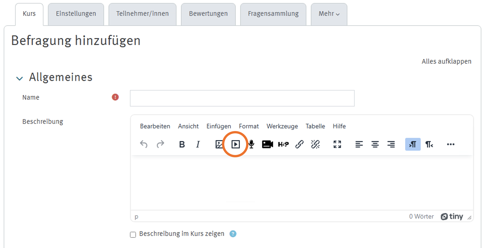
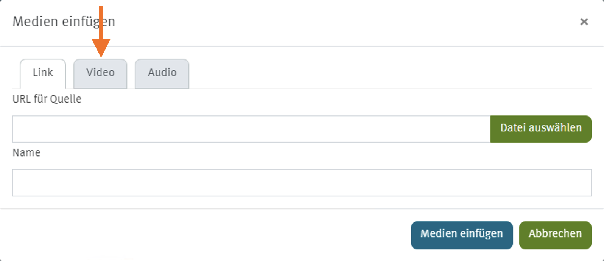
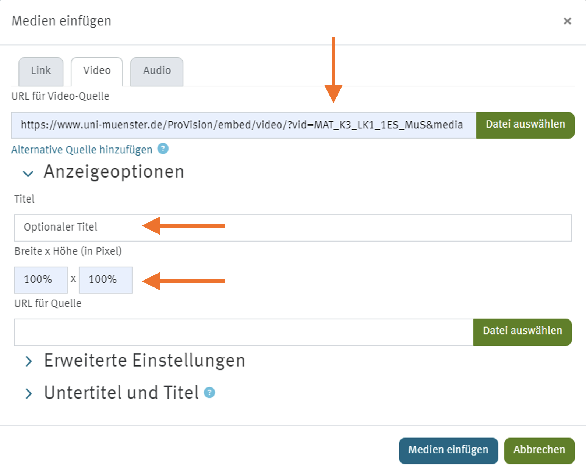
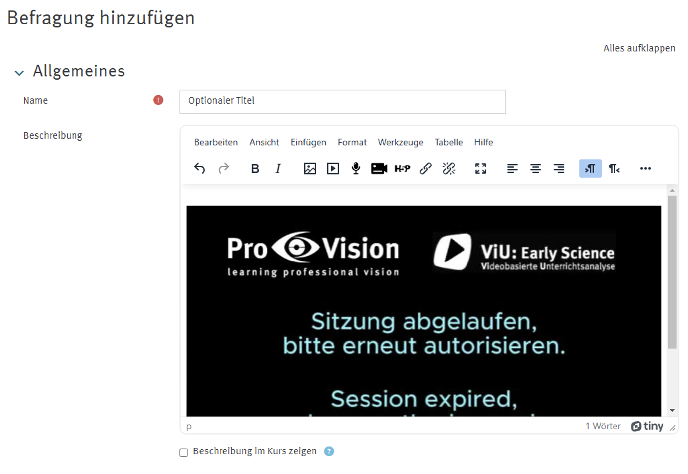

import { Tabs, TabItem } from '@astrojs/starlight/components';
import { Steps } from '@astrojs/starlight/components';
import MediaFrame from '/src/components/MediaFrame.astro';

### Anleitung: Einbettung als Medium / Videoquelle über den Moodle-Editor
**Erfordert: Medienlink**

<Steps>
    1. Bearbeitungsmodus im Moodle-Kurs aktivieren  
        - Bei einigen Moodle Varianten erfolgt dies oben rechts über „Bearbeiten einschalten“ (falls noch nicht aktiviert) (Bearbeitungsrechte im Moodle-Kurs erforderlich).  
    
    2. Medienlink einfügen 
        - Gehe zu dem Abschnitt, in dem du den Link/Video hinzufügen möchtest.  
        - Klicke auf Material oder Aktivität anlegen.  
        - Wähle im Moodle-Editor (auch WYSIWYG-Editor, z.B. TinyMCE) die Schaltfläche für "Multimedia" bzw. "Audio/Videodatei einfügen oder bearbeiten"
        - Füge dort den Medienlink (Einbettungslink mit &media) als URL für die (Video-)Quelle ein.
        - Prüfe, ob der eingefügte Link &media enthält, ergänze den Link falls nötig

        

            
Screenshots: Editor

            <Tabs>
                <TabItem label="Editor: Medien"></TabItem>
                <TabItem label="Medien > Video"></TabItem>
                <TabItem label="Video > Quelle"></TabItem>
            </Tabs>
        

    3. Einstellungen anpassen  
        - Unter Anzeigeoption gibt es die Option ein optionalen Titel hinzuzufügen.  
        - Passe die Abmessungen an, z. B. "100%" als Breite und Höhe.

    4. Speichern und anzeigen  
        - Klicke auf „Speichern und zum Kurs“ oder „Speichern und anzeigen“, um den Link zu überprüfen.
        - Das Video ist nun über die Beschreibung sichtbar.

        

            
Screenshots: Medien-Vorschau

            
        

</Steps>

Fertig! 🎉

### Einbettung des Logins (nur erforderlich für Medienlinks)

:::note[Hinweis]
Eine separate Einbettung des Logins ist nur erforderlich, wenn Medienlinks (MediaLink) in Aktivitäten in einem Moodle-Kurs verwendet werden.

Falls lediglich Einbettungslinks (EmbedLink) oder -codes (EmbedCode) verwendet werden, ist die separate Einbettung des Logins nicht nötig.
:::

- Die Einbettung des Logins ist zum Beispiel über Link-/URL-Aktivität möglich.
- Die Link-/URL-Aktivität wie folgt konfigurieren:
    - Name: z.B. "Login"
    - Externe-URL: Die folgende Login-URL einfügen:
        - https://www.uni-muenster.de/ProVision/embed/video/?login
    - Darstellung: Anzeigen: Einbetten