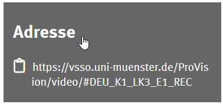

import { Tabs, TabItem } from '@astrojs/starlight/components';
import { Steps } from '@astrojs/starlight/components';
import MediaFrame from '/src/components/MediaFrame.astro';

### Übersicht: Moodle-Aktivitäten

Empfohlene Einbettungsvariante: [Link/URL-Aktivität](../activities/link)

| Moodle-Aktivität | Einbettungslink    | Einbettungscode        | Medienlink           | Kommentar                         |
|------------------|--------------------|------------------------|----------------------|-----------------------------------|
| Aufgabe          | ❌ nur als Link    | ☑️ nur Beschreibung   | ✅ ja                |                                  |
| Befragung        | ❌ nur als Link    | ✅ ja                 | ✅ ja                |                                  |
| Feedback         | ✅                 | ✅                    | ✅                   | nur bestimmte Frage-Typen        |
| Datei            | ✅                 | ✅                    | ✅                   | nur Beschreibung                 |
| Forum            | ❌ nur als Link    | ☑️ nur Beschreibung   | ✅ ja                |                                  |
| Test             | ✅                 | ✅                    | ✅                   | nur bestimmte Frage-Typen        |
| Text Seite       | ?                   | ?                     | ?                    |                                   |
| Lektion          | ❌ nur als Link    | ✅ ja                 | ✅ ja                |                                  |
| Link/URL         | ✅ ja (empfohlen)  | ☑️ nur Beschreibung   | ☑️ nur Beschreibung  |                                  |

:::note[Hinweis]
Eine separate [Einbettung des Logins](../media) ist erforderlich, wenn Medienlinks (MediaLink) in Aktivitäten in einem Moodle-Kurs verwendet werden.
Falls lediglich Einbettungslinks (EmbedLink) oder -codes (EmbedCode) verwendet werden, ist die separate Einbettung des Logins nicht nötig.
:::

#### Einfache Verlinkung
Nicht immer ist eine Einbettung des Videos nötig. Alternativ kann auch einfach zu einem Video auf dem Videoportal verlinkt werden. In diesem Fall stehen auch Kontextinformationen und Begleitmaterialien zum unmittelbaren Abruf bereit. Der Direktlink zu einem Video kann im Videoportal nach dem Selektieren eines Videos unter "Informationen" > "Adresse" des Videos abgerufen und kopiert werden.

    
Screenshot

    

